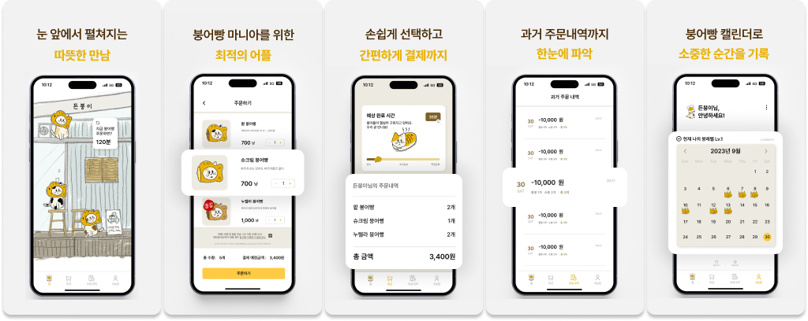

# 든붕이

### 프로젝트 소개

> 든붕이는 건국대학교 글로컬캠퍼스 창업 카페 ‘든든하쿠’에서 사용중인 붕어빵 미리 주문 애플리케이션으로,  
> 붕어빵을 미리 주문/결제하여 긴 대기 시간을 절약할 수 있어요!

### 진행 기간 👩🏻‍💻

- **2023.09.19 - 2023.11.29**

### 기술 스택

- 
  
  
  
  

### 구현한 기능

**든붕이**는 긴 대기 시간과 협소한 대기 공간으로 불편한 경험을 하셨던 분들을 위해 제작되었습니다.   
든붕이를 통해 미리 주문하고 소중한 시간을 절약하세요!   

① 주문 및 결제 간편화   
∙ 든붕이를 통해 붕어빵을 주문하고 간편하게 결제할 수 있습니다.   
∙ 가게에 방문해 결제하거나 번거로운 현금 결제 과정을 거치지 않고도 손쉽게 주문을 완료할 수 있습니다.

② 예상 소요 시간/대기 시간 확인   
∙ 든붕이를 통해 현재 예상 소요 시간과 주문한 붕어빵의 대기 시간을 확인할 수 있습니다.   
∙ 이를 통해 언제 주문할지를 결정하는 데 도움을 받을 수 있습니다.   

③ 주문 상태 확인   
∙ 주문한 붕어빵의 상태를 실시간으로 확인할 수 있습니다.   
∙ 주문이 대기중인지, 시간이 얼마나 남았는지, 완료되었는지를 어플을 통해 확인할 수 있어, 대기 시간을 최소화할 수 있습니다.   

### URL

- [🔗 App Store 로 이동하기](https://apps.apple.com/kr/app/%EB%93%A0%EB%B6%95%EC%9D%B4/id6471925416)
- [🔗Google Play 로 이동하기](https://play.google.com/store/apps/details?id=com.reliablekkufront&pcampaignid=web_share)

### 프로젝트 후기 🙇🏻‍♀️

- 실시간 데이터 처리의 복잡성
    - `SSE` 를 통해 실시간 주문 상태를 업데이트하면서 비동기 데이터 처리의 복잡성을 경험했습니다.
    - 서버와의 지속적인 연결을 유지하고, 이벤트 스트림을 안정적으로 관리하는 것이 중요하다는 것을 깨달았습니다.
- 결제 시스템 통합의 복잡성
    - 토스페이먼츠를 통해 결제 시스템을 통합하면서, 결제 과정의 보안성과 사용자 편의성을 모두 충족시키는 것이 얼마나 중요한지 배웠습니다.
    - 또한, 다양한 결제 실패 시나리오에 대한 대비책을 마련하는 것이 필요하다는 걸 느꼈습니다.
- 사용자 경험 향상
    - 앱 출시 후 직접 운영까지 하면서 사용자로부터 피드백을 받고, 이를 바로 수정하고 반영하면서 사용자 경험(UX)을 최적화하는 방법에 대해 많은 것을 배웠습니다.
    - 사용자 인터페이스를 개선하고, 앱의 응답 속도를 최적화하는 등 다양한 부분에서 사용자의 요구를 반영함으로써, 사용자 만족도를 높이는 것이 중요하다는 것을 실감했습니다.
